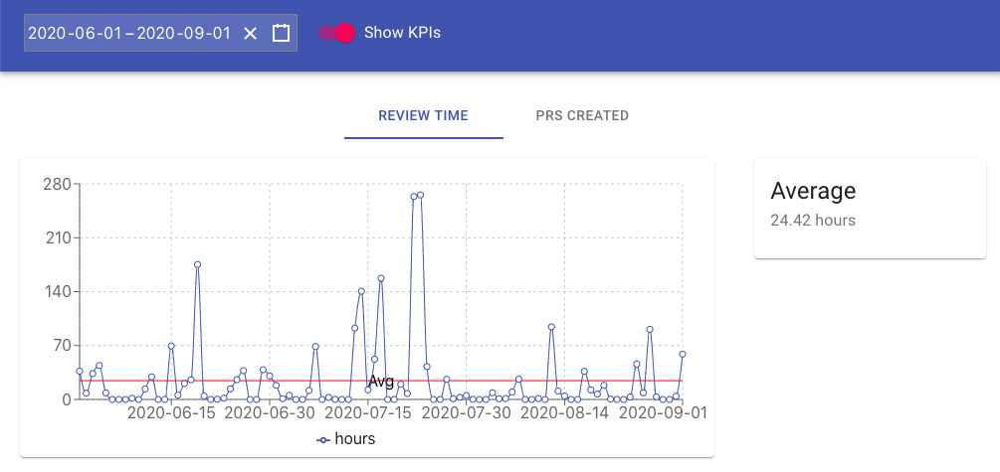
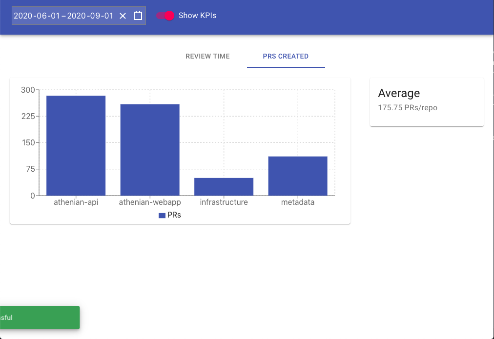
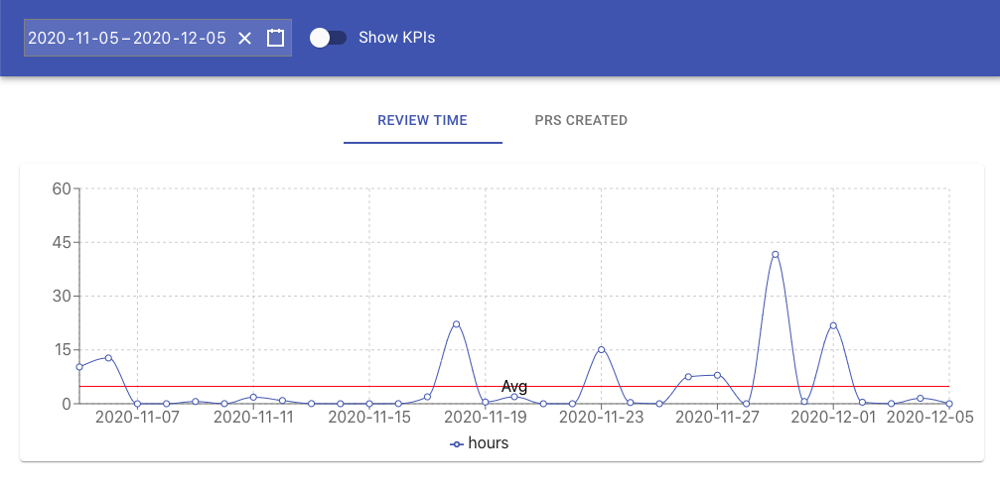

# Dev Metrics Dash

Quickly view and analyze your engineering team's data with this nifty dash

## Running the project in docker container

```js
cd dev-metrics-dash
```

```js
docker build -t dev-metrics-dash .
```

```js
docker run -dp 3000:3000 dev-metrics-dash
```

## Features

- material ui
- react hooks
- redux state management
- redux thunk middleware built-in
- date range picker with validation
- notifications
- switch to turn on and off KPIs
- tabs for two dashboards
- apis requesting data
- chart tooltips
- dynamically resizing charts
- chart animations

And much more!

## Screenshots



